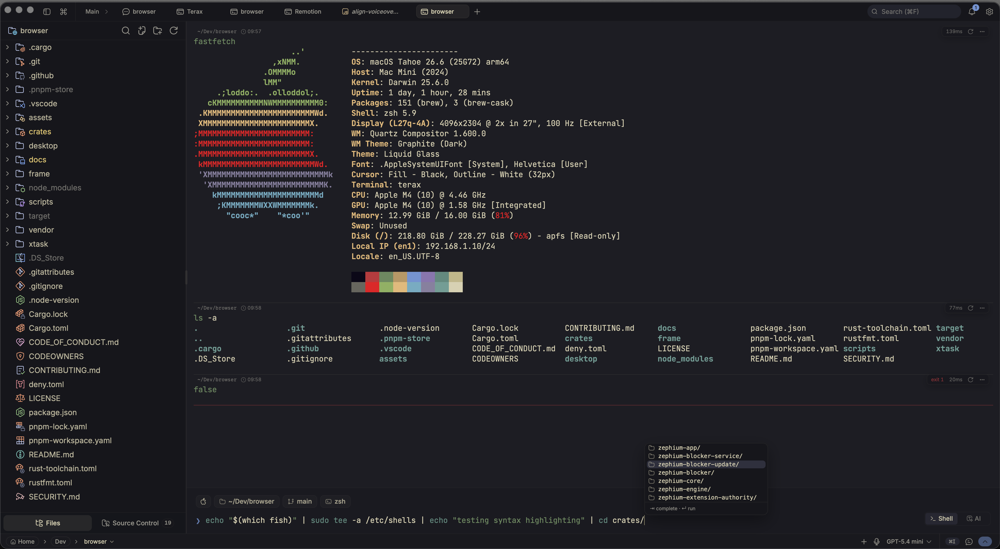

<div align="center">
  
  <h1>Paterm</h1>

  <p><strong>Lightweight terminal</strong></p>

</div>

<p align="center">
  <a href="docs/readme/README.zh-CN.md">简体中文</a> |
</p>

---

Paterm is a lightweight open-source terminal-first development environment built on Tauri 2 + Rust and React 19. A native PTY backend with a WebGL renderer, plus a code editor, file explorer, and a web preview pane built in. About 7-8 MB on disk. No telemetry. No account.

## Screenshots

<table>
  <tr>
    <td colspan="2" align="center"><br/><sub>Block-based WebGL terminal with editor-like input panel</sub></td>
  </tr>
  <tr>
    <td colspan="2" align="center"><br/><sub>Web preview of local dev servers</sub></td>
  </tr>
  <tr>
    <td colspan="2" align="center"><br/><sub>Custom themes, presets, and background images</sub></td>
  </tr>
</table>

## Features

### Terminal

- xterm.js with WebGL renderer, multi-tab with background streaming
- GPU-accelerated block-based terminal with editor-like command input
- Native PTY backend via `portable-pty` (zsh, bash, pwsh, fish, cmd)
- Split panels (horizontal and vertical)
- Inline search, link detection, true-color
- Drag files from the explorer or desktop into a terminal as shell-safe quoted paths
- Per-tab workspace environments on Windows (Local, or any installed WSL distro)
- Spaces restore tabs, working directories, and split layouts across launches

### Code editor

- CodeMirror 6 (supports all popular languages - TS/JS, Rust, Python, Go, C/C++, Java, HTML/CSS, JSON, Markdown, etc.)
- Opt-in language server support with diagnostics, navigation, completion, formatting, and custom servers
- Rendered Markdown plus image, video, audio, and PDF viewing
- Vim mode
- Built-in editor themes including Kanagawa, Catppuccin, Rosé Pine, Everforest, Dracula, Solarized, Nord, Tokyo Night, GitHub, and Xcode

### File explorer

- Catppuccin icon theme
- Fuzzy search, keyboard navigation, inline rename, context actions
- Live updates when files change on disk

### Web preview

- Auto-detects local dev servers and opens them in a preview tab
- External URL preview via a native child webview

### Themes and customization

- Custom themes built in-app, switch between bundled presets and your own
- Create your own themes, share them or import from the community
- Background images with adjustable opacity and blur
- Editor theme is independent from the app theme

## Install

Latest installers are on the [Releases](https://github.com/xxpac/paterm/releases/latest) page.

### Windows notes

- Default shell detection: `pwsh.exe` (PowerShell 7+) -> `powershell.exe` (Windows PowerShell 5.1) -> `cmd.exe`.
- WSL is a first-class workspace environment, not a wrapped subprocess.

### Linux notes

- **Arch / AUR:** `yay -S paterm-bin` (or `paru`, etc.). Tracks the latest release.
- **NixOS / Nix**: use the official flake - `nix profile install github:crynta/paterm` (non-NixOS), or import the flake and add `inputs.paterm.packages.${pkgs.system}.paterm` to `environment.systemPackages` (NixOS). The `nixosModules.paterm` output is also available for a simpler setup.
- **AppImage:** needs FUSE. Without it: `./Paterm_*.AppImage --appimage-extract-and-run`. On Wayland with rendering glitches, try `WEBKIT_DISABLE_DMABUF_RENDERER=1`. Otherwise the `.deb` / `.rpm` packages link against the system GTK stack and tend to be smoother.

## Build from source

**Prerequisites**
- Rust (stable), https://rustup.rs
- Node 20+ and [pnpm](https://pnpm.io)
- Tauri prerequisites for your platform, https://tauri.app/start/prerequisites/

**Run**
```bash
pnpm install
pnpm tauri dev          # development
pnpm tauri build        # production bundle
```

For per-OS package and portable builds (Windows / macOS / Linux), including
installer types, output paths, and the updater-signing gotcha, see
[docs/building.md](docs/building.md).

**Checks**
```bash
pnpm lint
pnpm check-types
pnpm test
cd src-tauri && cargo clippy --all-targets --locked -- -D warnings   # Rust lint (matches CI)
cd src-tauri && cargo nextest run --locked                           # or: cargo test --locked
```

## Tech stack

Tauri 2, Rust, `portable-pty`, React 19, TypeScript, Vite, xterm.js, CodeMirror 6, Tailwind v4, shadcn/ui, Zustand.

## Contributing

Issues and PRs are welcome! Feel free to open issues, suggest features, or submit pull requests. See [CONTRIBUTING.md](CONTRIBUTING.md) and the [architecture docs](docs/README.md) for more details.

## License

Paterm is licensed under the Apache-2.0 License. For more information on our dependencies, see [Apache License 2.0](LICENSE).
